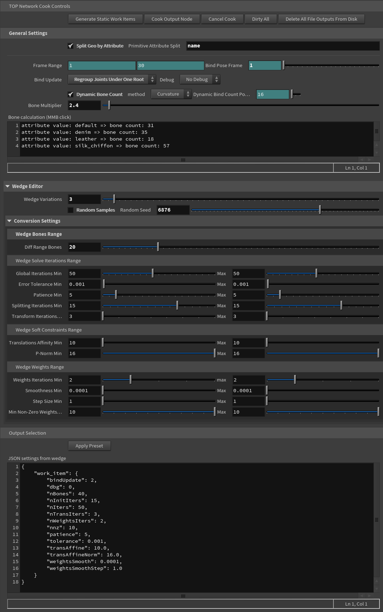

# ./Run Dem Bones 
## Houdini PDG Tool for Smooth Skinning Decomposition with Rigid Bones


A houdini digital (SOP) asset that utilises PDG wedging to turn alembic animations into skinned fbx files.
Extended functionality based on the SideFX Labs DemBones HDA.

## Features:
  - Define through primitive attribute how to split up the geometry.
  - A dynamic Bone calculation method based on curvature complexity on a specific frame.
  - Easily switch between results on the SOP level.
  - Apply the unique parameters of your wedge onto the top level parameters. This allows the asset to run faster and guarantees an accurate reconstruction when the input changes.
  - Each wedge is merged into one skeleton

## Roadmap:
  - introduce daisy chain method into package (thanks to Ben Schrijvers)
  - fix root bone issue in unreal
  - introduce the feature to solve bone transformation for a mesh animation given skinning weights
  - solving skinning weights from shapes and skeleton poses, e.g. converting blendshapes to LBS,

# How to install
Open the json package file, change the location to your directory and copy it to your Houdini documents / packages folder.

# Usage

## Overview
This interface is part of a Houdini PDG (Procedural Dependency Graph) tool that utilizes the open-source software 'Dem Bones,' developed by SEED (Search for Extraordinary Experiences Division) at Electronic Arts (EA). The compiled version is provided by SideFX Labs. 'Dem Bones' is an implementation of the algorithm for Smooth Skinning Decomposition with Rigid Bones, which is essential for character animation in 3D graphics.

## Interface Explanation

### General Settings

- **Split Geo by Attribute**: Allows splitting geometry based on a specified attribute, typically 'name' for named parts of the mesh.
- **Frame Range**: Defines the frame range for the animation that you're working with.
- **Bind Pose Frame**: The specific frame that is considered the bind pose for the character.

### Bone Count

- **Dynamic Bone Count**: When active the bone count is automatically calculated based on the method. When this parameter is set to non-active, you can define a specific bone count taking the split geo by attribute settings into account.
- **Method**: Based on curvature or surface area taking the split geo by attribute settings into account.
- **Bone Multiplier**: A multiplier that influences the number of bones to be used.
- **Bone Calculation (MMB click)**: Lists how the attribute values correspond to the number of bones calculated.

### Wedge Editor

- **Wedge Variations**: The number of variations to compute.
- **Random Samples**: Each wedge is a random value if active, when non-active each wedge is an even distribution between the min and max
- **Random Seed**: A seed value for random number generation to ensure reproducibility.

### Conversion Settings

- **Wedge Bones Range**: Adjusts the range for the difference in the number of bones.
- **Global Iterations Min/Max**: The range for the number of global iterations for the solving process.
- **Error Tolerance Min/Max**: The acceptable range for the error tolerance in the solution.

### Wedge Weights Range

- **Weights Iterations Min/Max**: Sets the minimum and maximum iterations for weight computation.
- **Smoothness Min/Max**: Determines how smooth the weight transitions should be.

### Output Selection

- **Apply Preset**: Applies the selected preset configuration to the current setup.

### JSON Settings from Wedge

A JSON representation of the current settings which can be used for scripting or replication of the setup in another environment.

```json
{
  "work_item": {
    "bindUpdate": 2,
    "dbg": 0,
    "nBones": 40,
    "nIters": 50,
    "nTransIters": 15,
    "nTransIters": 3,
    "nWeightsIters": 2,
    "nnz": 10,
    "patience": 5,
    "tolerance": 0.001,
    "transAffineNorm": 10.0,
    "transAffineNorm": 16.0,
    "weightsSmooth": 0.0001,
    "weightsSmoothStep": 1.0
  }
}
```

## Interface


A demo of the tool can be found in the hip directory under the root of this repository project:
- https://github.com/RightUpNorth/Right-Up-North-Dem-Bones-PDG

Vellum settings derived from the following tutorial:
-  https://www.sidefx.com/tutorials/h17-vellum-cloth-lookdev-tips/

# What is Dem Bones?

Open Source repository developed by SEED EA based on the implementation of Smooth Skinning Decomposition with Rigid Bones, 
Compiled version in this repository is generated by SideFX Labs.

- https://github.com/electronicarts/dem-bones

An automated algorithm to extract the Linear Blend Skinning (LBS) with bone transformations from a set of example meshes. 
Skinning Decomposition can be used in various tasks:

- converting any animated mesh sequence, e.g. geometry cache, to LBS, which can be replayed in popular game engines,
- solving skinning weights from shapes and skeleton poses, e.g. converting blendshapes to LBS,
- solving bone transformations for a mesh animation given skinning weights.

Based on the following papers:

Binh Huy Le and Zhigang Deng. Smooth Skinning Decomposition with Rigid Bones. ACM Transactions on Graphics 31(6), Proceedings of ACM SIGGRAPH Asia 2012.

Binh Huy Le and Zhigang Deng. Robust and Accurate Skeletal Rigging from Mesh Sequences. ACM Transactions on Graphics 33(4), Proceedings of ACM SIGGRAPH 2014.

This project is named after "The Skeleton Dance" by Super Simple Songs.

# Work Item Configuration README

This README file describes the attributes used in the work item JSON configuration. Each attribute corresponds to a specific parameter in the PDG work item setup for a subprocess command.

## JSON Attributes

- `nBones`: Integer - The number of bones to be used in the process.
  - Example: `42`

- `nInitIters`: Integer - The number of iterations per initial cluster splitting.
  - Example: `10`

- `nIters`: Integer - The number of global iterations for the process.
  - Example: `5`

- `tolerance`: Double - The convergence tolerance. The process stops if the error relatively reduces less than this value in the number of consecutive iterations defined by `patience`.
  - Example: `0.001`

- `patience`: Integer - The convergence patience. Used in conjunction with `tolerance` to determine when to stop the process.
  - Example: `3`

- `nTransIters`: Integer - The number of transformation update iterations per global iteration.
  - Example: `2`

- `bindUpdate`: Integer - Determines if the bind pose should be updated (0=no update, 1=update joint positions, 2=regroup joints under one root).
  - Example: `1`

- `transAffine`: Double - The bone translations affinity soft constraint.
  - Example: `0.5`

- `transAffineNorm`: Double - The p-Norm for bone translations affinity.
  - Example: `1.5`

- `nWeightsIters`: Integer - The number of weight update iterations per global iteration.
  - Example: `4`

- `nnz`: Integer - The number of non-zero weights per vertex.
  - Example: `8`

- `weightsSmooth`: Double - The weights smoothness soft constraint.
  - Example: `0.05`

- `weightsSmoothStep`: Double - The step size for the weights smoothness.
  - Example: `0.01`

- `dbg`: Integer - The debug level for the process.
  - Example: `2`

## Usage

To use these configurations, replace the placeholder values with actual paths and numerical values relevant to your specific use case. The JSON file should be structured as shown in the example, with each attribute being a key-value pair within the `work_item` dictionary.
